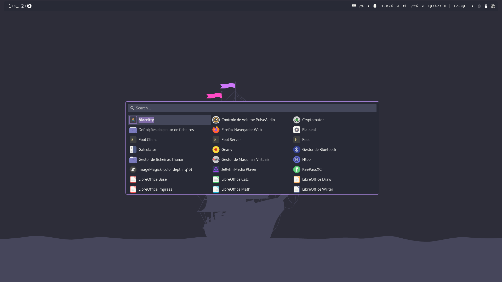

# Dotfiles

Here are my personal dotfiles used on Debian.

## Preview

This is what my dotfiles will look like:



## Install

First, clone this repository:

```
git clone https://gitlab.com/patricio-simoes/dotfiles.git
```

Then, in order to install, make sure that the "DOTFILES" variable on the install script points to the directory where you cloned this repo.
After that, just run the install script:

```
cd dotfiles
chmod 700 ./install.sh
install.sh
```
