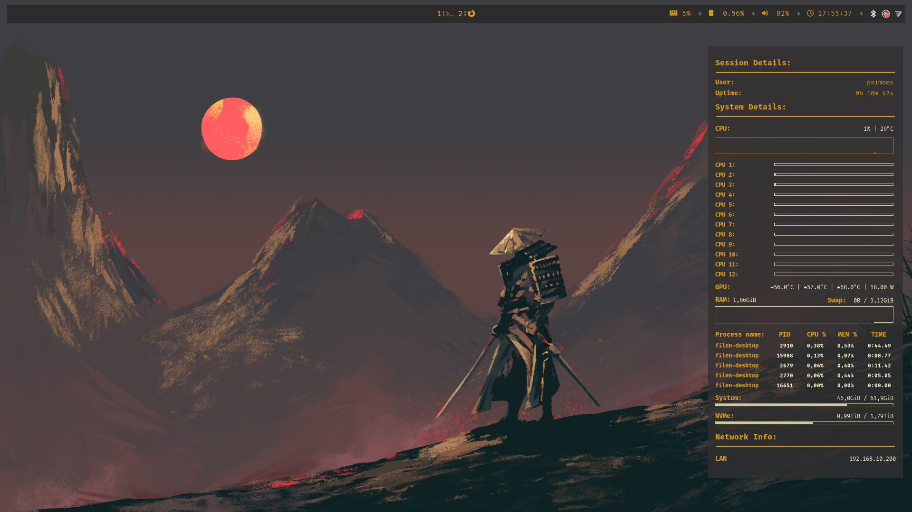
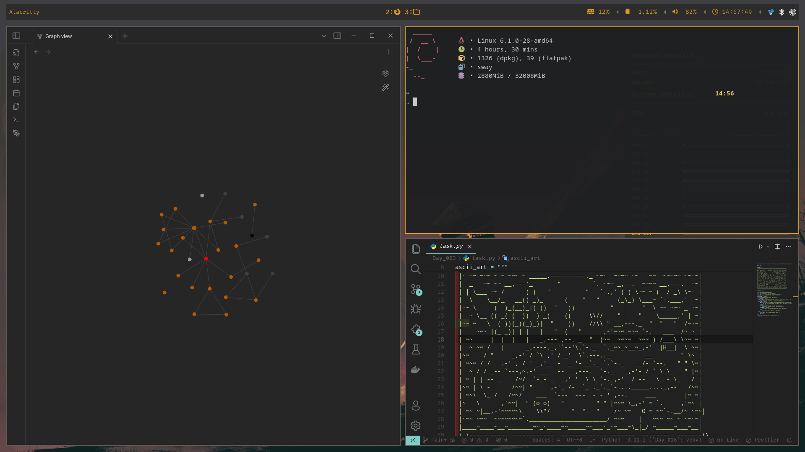
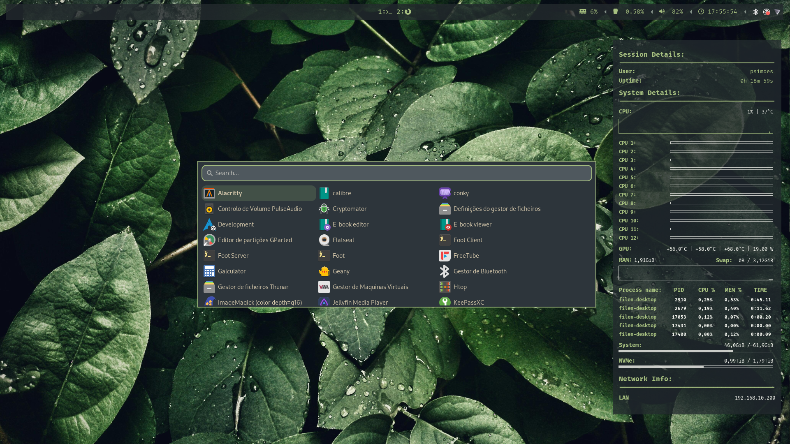
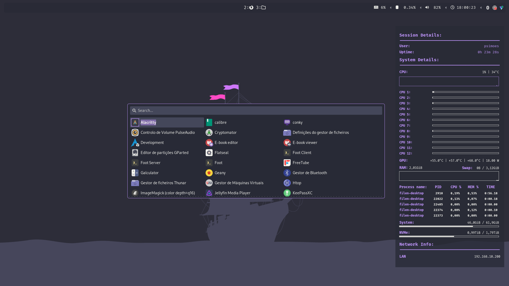

# Dotfiles

Here are my personal dotfiles used on Debian.

## Preview

This is what my dotfiles will look like:





I have also created a script that easily changes the theme across applications.
By pressing Ctr+0, Ctr+1, etc, the theme changes without much effort:





## Install

First, clone this repository:

```
git clone https://gitlab.com/patricio-simoes/dotfiles.git
```

After that, just run the install script:

```
cd dotfiles
chmod 700 ./install.sh
install.sh
```
